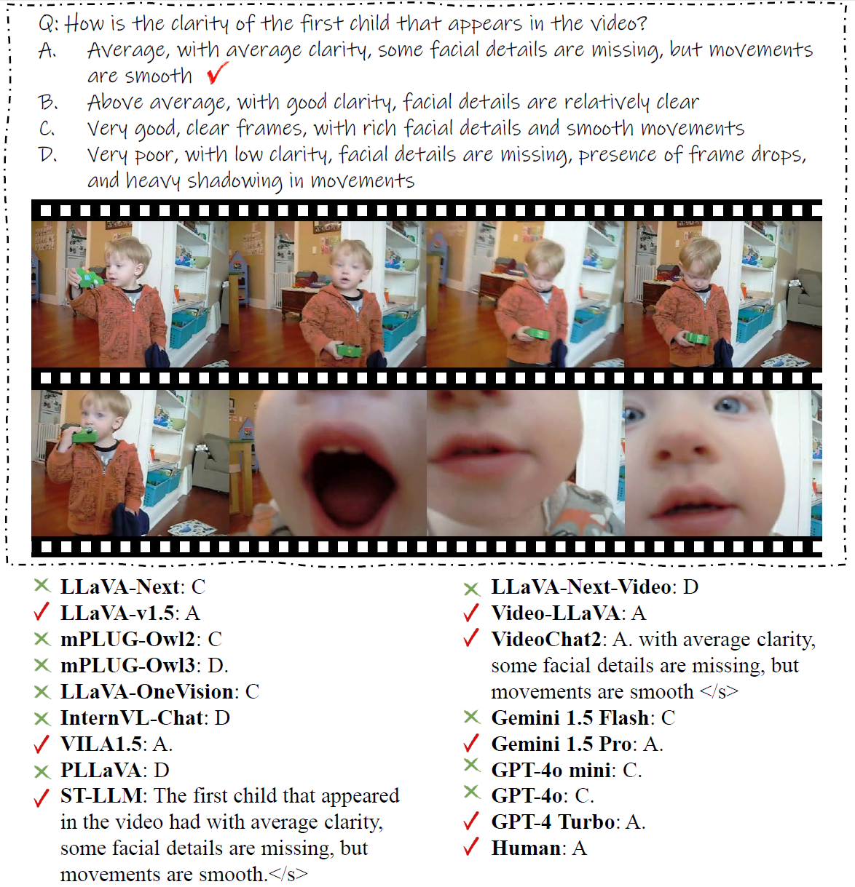
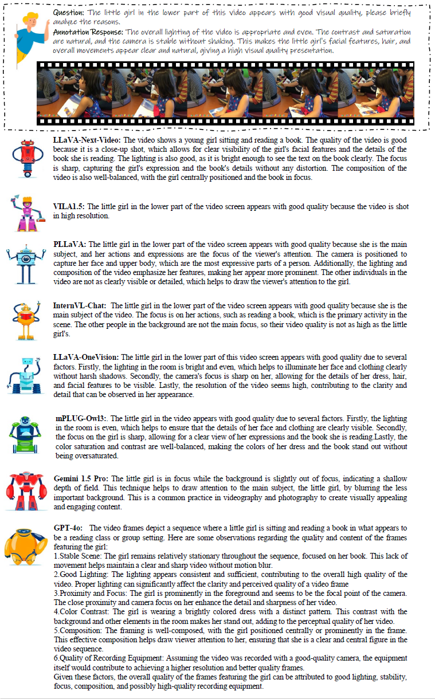

    
    
 

    
    
    
   

  
  <h1>Q-Bench-Video: Benchmark the Video Quality Understanding of LMMs</h1>
  
_How LMMs Perform on Video Quality Understanding?_

  

      <a href="https://zzc-1998.github.io/" target="_blank">Zicheng Zhang</a>1*,
      <a href="https://scholar.google.com/citations?user=JYqad5sAAAAJ&hl=zh-CN" target="_blank">Ziheng Jia</a>1*,
      <a href="https://teowu.github.io/" target="_blank">Haoning Wu</a>2#,
      <a href="https://github.com/lcysyzxdxc" target="_blank">Chunyi Li</a>1,
      <a href="https://scholar.google.com.hk/citations?user=NSR4UkMAAAAJ&hl=zh-CN" target="_blank">Zijian Chen</a>1
      <a href="https://scholar.google.com/citations?hl=zh-CN&user=85yWgIcAAAAJ" target="_blank">Yingjie Zhou</a>1,
  

      <a href="https://scholar.google.com/citations?hl=zh-CN&user=nDlEBJ8AAAAJ" target="_blank">Wei Sun</a>1,
      <a href="https://scholar.google.ca/citations?user=Tq2hoMQAAAAJ&hl=en" target="_blank">Xiaohong Liu</a>1,
      <a href="https://minxiongkuo.github.io/" target="_blank">Xiongkuo Min</a>1,
      <a href="https://personal.ntu.edu.sg/wslin/Home.html" target="_blank">Weisi Lin</a>3,
      <a href="https://ee.sjtu.edu.cn/en/FacultyDetail.aspx?id=24&infoid=153&flag=153" target="_blank">Guangtao Zhai</a>1#
      
  

  

  1Shanghai Jiaotong University,  2IN.AI, 3Nanyang Technological University
       
   

*Equal contribution. #Corresponding author. 
   

  <a href="https://github.com/Q-Future/Q-Bench-Video/blob/main/A_Bench__Are_LMMs_Masters_at_Evaluating_AI_generated_Images_.pdf"><strong>Paper</strong></a> |
<a href="https://github.com/Q-Future/Q-Bench-Video"><strong>Github</strong></a> |
 <a href="https://huggingface.co/datasets/q-future/Q-Bench-Video"><strong>Data</strong></a> 
  

      
  

  

    
We introduce **Q-Bench-Video**, a new benchmark specifically designed to evaluate LMMs' proficiency in discerning video quality. 

A. To ensure the diversity of video sources, Q-Bench-Video encompasses videos from natural scenes, computer graphics (CG), and AI-generated content (AIGC). 

B. Building on the traditional multiple-choice questions format with the *Yes-or-No* and *What-How* categories, we include *Open-ended* questions to better evaluate complex scenarios. Additionally, we incorporate the **video pair quality comparison** question to enhance comprehensiveness. 

C. Beyond the traditional *Technical*, *Aesthetic*, and *Temporal* distortions, we have expanded our evaluation aspects to include the dimension of *AIGC* distortions, which addresses the increasing demand for video generation.
 
Finally, we collect a total of 2,378 question-answer pairs and test them on 12 open-source \& 5 proprietary LMMs. Our findings indicate that **while LMMs have a foundational understanding of video quality, their performance remains incomplete and imprecise, with a notable discrepancy compared to human-level performance**.

## Release
- [To Do] 🔥 Release the technical report and data for **Q-Bench-Video**. Coming soon.
- [2024/9/20] 🔥 [Github repo](https://github.com/Q-Future/Q-Bench-Video) for **Q-Bench-Video** is online. Do you want to find out how your LMM performs on video quality understanding? Come and test on **Q-Bench-Video** !!

  
## Q-Bench-Video Construction
    
In this benchmark, the meta-structure tuple **(V,Q,A,C)** of each data item can be decomposed into several components: the video object **V** (which can be a single video or a pair of videos), the video quality query **Q**, the set of possible answers **A**, and the correct answer **C**.
The subcategories are organized as follows:

1. **Question Types**: Yes-or-No Questions, What-How Questions, Open-ended Questions
2. **Quality Concerns**: Technical, Aesthetic, Temporal, and AIGC
3. **Single Videos \& Video Pairs**: Single-Global, Single-referring, Pair-Compare-Coarse, Pair-Compare-Fine
   
  

      
  

  
## Glance at Q-Bench-Video Performance
For *open-source* models, **mPLUG-Owl3** takes the first place. For *closed-source* models, **GPT-4o** takes the first place.

  

    
**A Quick Look of the Q-Bench-Video Outcomes.**

| Model                                  | Yes-or-No  | What-How  | Open-ended  | Technical  | Aesthetic  | Temporal  | AIGC  | Overall  |
|----------------------------------------|-----------|-----------|-----------|-----------|-----------|-----------|-----------|-----------|
| **Random guess** *w/o Open-ended*      | 50.00%    | 25.00%    | /         | 37.10%    | 37.31%    | 37.25%    | 37.22%    | 37.79%    |
| **Human**                              | 86.57%    | 81.00%    | 77.11%    | 79.22%    | 80.23%    | 82.72%    | 86.21%    | 81.56%    |
| *Open-source Image LMMs*               |           |           |           |           |           |           |           |           |
| LLaVA-Next (*Mistral-7B*)              | 62.83%    | 45.14%    | 33.69%    | 46.38%    | 57.86%    | 47.84%    | 48.46%    | 47.52%    |
| LLaVA-v1.5 (*Vicuna-v1.5-13B*)         | 52.98%    | 46.44%    | 37.01%    | 45.77%    | 58.12%    | 45.30%    | 46.48%    | 45.64%    |
| mPLUG-Owl2 (*LLaMA2-7B*)               | 59.19%    | 39.07%    | 31.19%    | 42.07%    | 52.38%    | 41.71%    | 39.37%    | 43.43%    |
| *Open-source Video LMMs*               |           |           |           |           |           |           |           |           |
| mPLUG-Owl3 (*Qwen2-7B*)                | 60.48%    | **56.39%**| _39.48%_  | **52.68%**| 58.31%    | **52.05%**| 43.49%    | **52.39%**|
| LLaVA-OneVision (*Qwen2-7B*)           | 61.34%    | _53.88%_  | 39.15%    | 49.35%    | **64.15%**| 50.68%    | 44.30%    | _51.70%_  |
| InternVL-Chat (*Vicuna-7B*)            | **66.02%**| 52.13%    | 33.93%    | 48.42%    | 52.73%    | 50.59%    | _53.12%_  | 51.11%    |
| VILA1.5 (*LLaMA3-8B*)                  | 61.95%    | 46.00%    | **39.60%**| 47.85%    | 57.85%    | 45.65%    | 42.57%    | 49.41%    |
| PLLaVA (*Mistral-7B*)                  | _65.63%_  | 52.33%    | 32.23%    | _49.69%_  | _61.32%_  | _50.96%_  | **53.64%**| 50.39%    |
| LLaVA-Next-Video (*Mistral-7B*)        | 61.34%    | 45.95%    | 38.10%    | 49.03%    | 60.94%    | 46.97%    | 49.40%    | 48.69%    |
| ST-LLM (*Vicuna-v1.1-7B*)              | 44.63%    | 28.50%    | 32.78%    | 34.99%    | 46.11%    | 34.28%    | 34.02%    | 35.42%    |
| Video-LLaVA (*Vicuna-v1.5-7B*)         | 64.67%    | 40.79%    | 29.11%    | 43.25%    | 54.04%    | 42.38%    | 42.76%    | 43.49%    |
| VideoChat2 (*Mistral-7B*)              | 56.09%    | 29.98%    | 34.99%    | 39.26%    | 50.02%    | 38.25%    | 35.88%    | 40.56%    |
| *Proprietary LMMs*                     |           |           |           |           |           |           |           |           |
| **Gemini 1.5 Flash**                   | 65.48%    | 56.79%    | 47.51%    | 54.11%    | _66.58%_  | 53.51%    | 50.22%    | 56.78%    |
| **Gemini 1.5 Pro**                     | 65.42%    | **62.35%**| _47.57%_  | **56.80%**| **69.61%**| 53.38%    | **53.26%**| _58.63%_  |
| **GPT-4o mini**                        | 62.95%    | 50.93%    | 42.10%    | 49.38%    | 60.90%    | 48.43%    | 41.71%    | 52.20%    |
| **GPT-4o**                             | **67.48%**| _58.79%_  | **49.25%**| _56.01%_  | 58.57%    | **65.39%**| _52.22%_  | **58.70%**|
| **GPT-4 Turbo**                        | _66.93%_  | 58.33%    | 40.15%    | 54.23%    | 66.23%    | _54.00%_  | 52.04%    | 56.36%    |

  
    
We release the performance of LMMs against humans.
Several conclusions can be obtained: 
    
1) **General Performance. Human>Proprietary LMMs>Open-source LMMs>Random guess.**

2) **Open-ended questions are more challenging for LMMs.**

3) **MMs exhibit unbalanced performance across different types of distortions.**

  

**Qualitative Comparison for MCQ Questions**

  

**Qualitative Comparison for Open-ended Questions**

## Evaluate your model on Q-Bench-Video

Details are coming soon!

### Legacy

Details are coming soon!

## Contact

Please contact any of the first authors of this paper for queries.

- Zicheng Zhang, `zzc1998@sjtu.edu.cn`, @zzc-1998

## Citation

